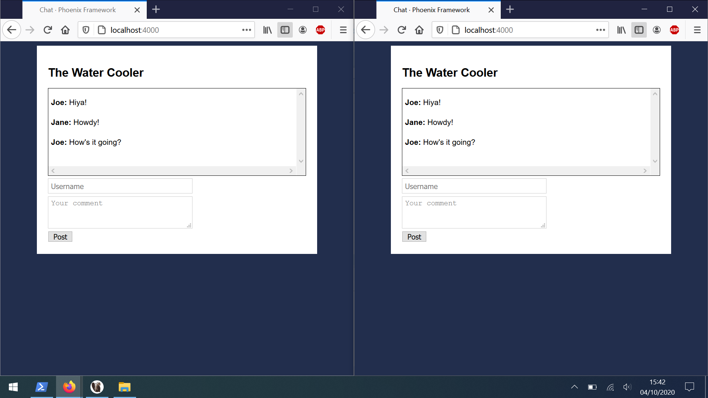
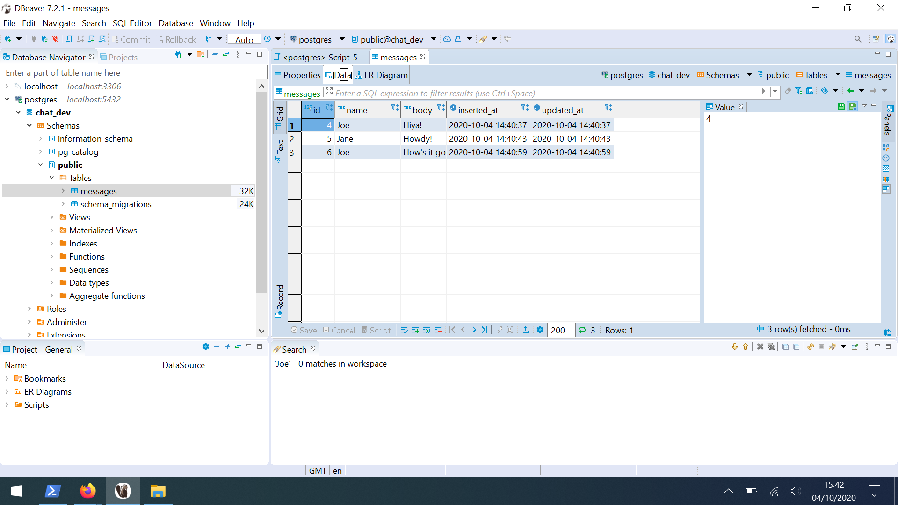

**Setting up Phoenix and Postgres so we can follow the chat room tutorial: https://www.youtube.com/watch?v=ZUNzXbIP_FQ**

I am using PowerShell. I didn't have Phoenix or Postgres installed on my machine before starting the tutorial.

**To do:**

Install Phoenix: `mix archive install hex phx_new`

Install Postgres:

This requires a few steps. 

- `choco install postgresql` from an Admin PowerShell. This will take 5 mins or so. On my machine the installation produced a random `postgres` user password. Make sure you save that somewhere.
- Once installed, run: `psql -U postgres` and give the password that you saved. 
- Now change the password **postgres**: `alter user postgres with password 'postgres';`. 

The last step allows the `mix ecto.create` command to run as expected. 

You should be able to follow the video from here on.

https://nexusger.de/posts/2015-10-30-elixir-postgres-and-chocolatey/

---

(renamed root folder, was originally `chat`)

**Demo**

**Persistent State** - we can refresh windows and restart the server without losing chat history

